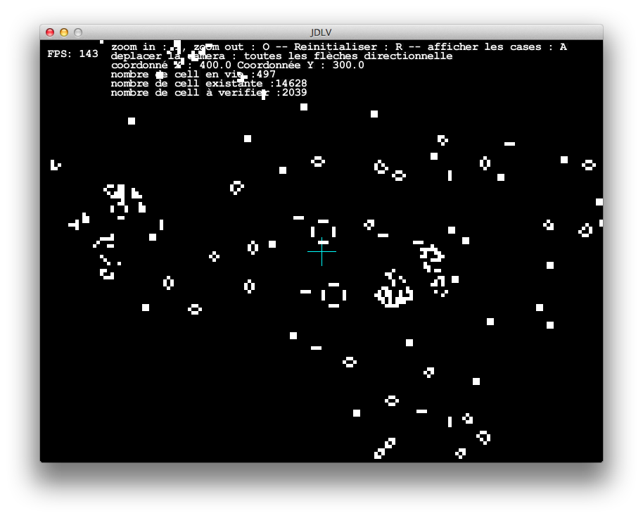
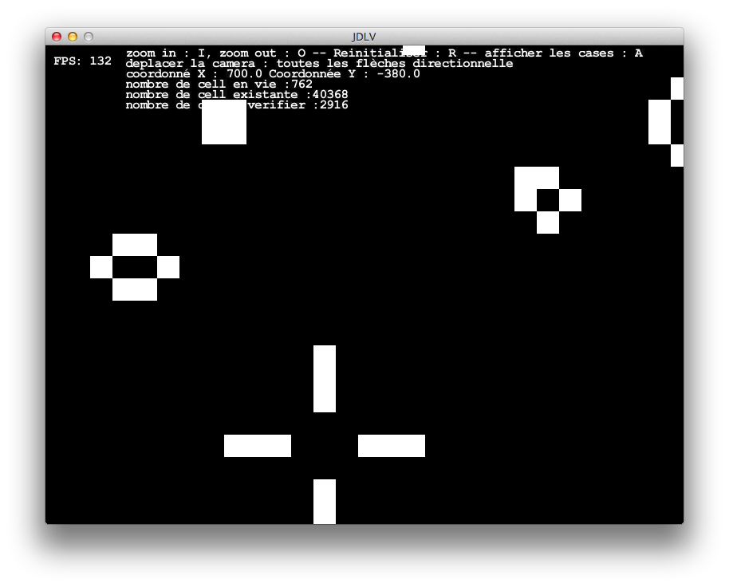
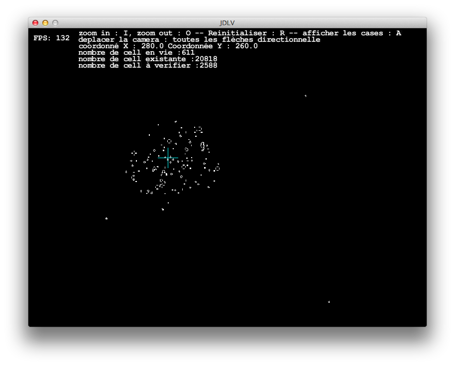

Game of life - Jeux de la vie - slick
=================

Attempt to create a gameof life with JAVA + lwgjl + slick2d

# Compil and run
``` bash
bash build_and_run.sh
```

# Screenshot
Start 
Zoom In 
You can see your glider fly away with Zoom Out 

Only tested on

 + mac 10.9.5
 + java version "1.6.0_65"


# LICENSE

MIT
